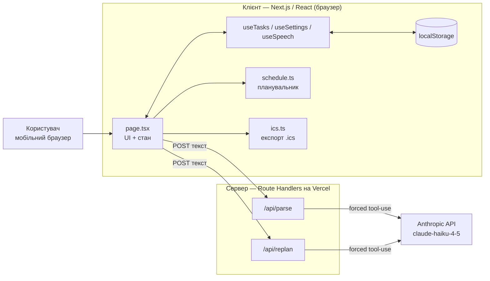
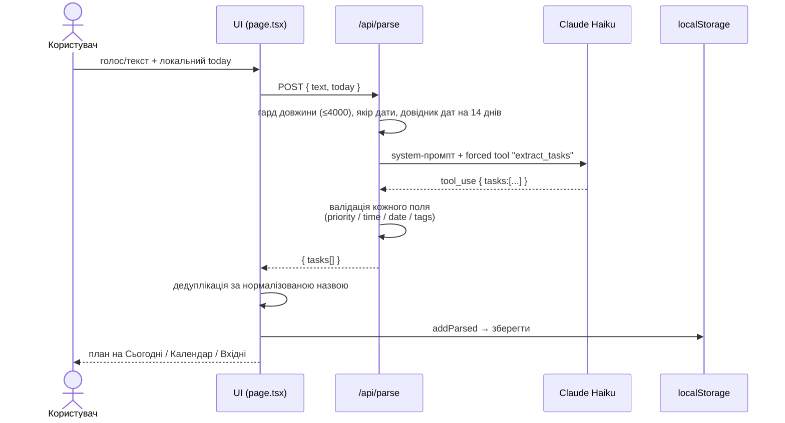
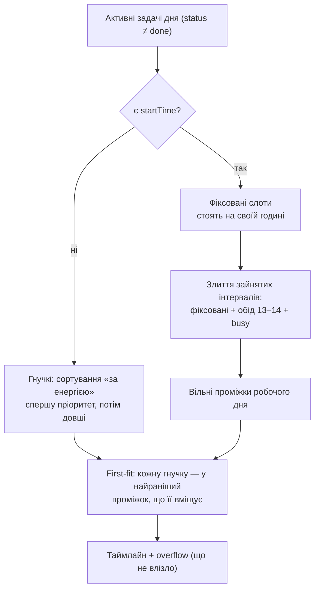
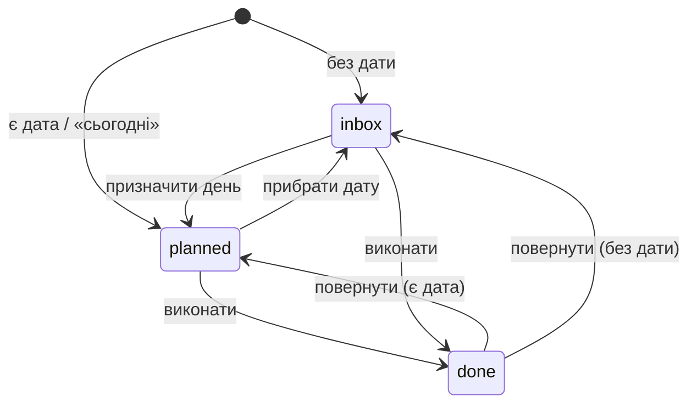

# Архітектура — AI Планер дня

Документ для рев'ю: як влаштований застосунок, які рішення прийняті й чому.
Короткий продуктовий опис — у [README](README.md).

## 1. Огляд

**Продукт.** Мобільний веб-планер. Користувач «вивалює» все з голови (голосом
або текстом) — AI перетворює хаос на структуровані задачі й збирає план на день.

**Наскрізний сценарій.** Brain dump → AI-парсинг у задачі (пріоритет, час,
дедлайн, теги) → детермінований план дня «за енергією» → експорт у календар.

**Головна архітектурна теза.** AI відповідає **лише за розуміння природної
мови**. Усе, що впливає на коректність плану (розкладання за часом,
реалістичність, дати, експорт), робить **детермінований код на клієнті**. Це
робить демо передбачуваним: якщо модель віддала дивний результат — план не
«їде», бо його будує не модель.

## 2. Технологічний стек

| Шар | Технологія |
| --- | --- |
| Фреймворк | Next.js 15 (App Router) |
| UI | React 19, TypeScript (strict) |
| AI | Anthropic API, модель `claude-haiku-4-5`, **forced tool-use** |
| Сховище | `localStorage` браузера (без бекенд-БД, без логіну) |
| Голос | Web Speech API (`uk-UA`) |
| Тести | Vitest (юніт на чисті функції) |
| Якість | ESLint (`next/core-web-vitals`), `tsc --noEmit` |
| Хостинг | Vercel (auto-deploy на push у `main`) |

## 3. Структура репозиторію

```
app/
  layout.tsx            корінь, метадані, lang="uk"
  page.tsx              увесь UI + стан (Today / Calendar / Inbox, шторки, свайп)
  globals.css           стилі, світла/темна тема через prefers-color-scheme
  api/
    parse/route.ts      AI: brain dump → задачі (tool extract_tasks)
    replan/route.ts     AI: вільний текст → зайняті інтервали (tool extract_busy)
lib/
  types.ts              контракт Task / ParsedTask, пріоритети, константи
  store.ts              хуки useTasks / useSettings, мутації стану + persist
  date.ts               ЄДИНЕ джерело дат (локальні, без UTC-зсуву) + coerceDate
  schedule.ts           планувальник дня «за енергією» (детермінований)
  ics.ts                експорт .ics (день і цілий місяць)
  parse-utils.ts        coerceTime + ліміт вводу (спільне для роутів)
  text.ts               українська множина (plural)
  useSpeech.ts          обгортка Web Speech API
tests/                  юніт-тести (date, parse-utils, text, schedule, ics)
```

## 4. Архітектура (високий рівень)



**Ключове:** API-ключ Anthropic живе **тільки на сервері** (env `ANTHROPIC_API_KEY`)
і в браузер не потрапляє. Клієнт спілкується лише зі своїми роутами
`/api/parse` та `/api/replan`.

## 5. Потік даних: brain dump → задачі



**Чому forced tool-use.** `tool_choice: { type: "tool" }` змушує модель
повернути валідний JSON за схемою інструмента, а не «сирий» текст. Сервер
**не довіряє формату наосліп**: `coercePriority`, `coerceTime`, `coerceDate`,
фільтрація тегів і порожніх назв — усе нормалізується перед віддачею клієнту.

**Дати — без UTC-зсуву.** Клієнт передає свій **локальний** `today`; сервер
будує з нього довідник дат на 14 днів наперед, а модель бере відносні дати
(«завтра», «у пʼятницю») лише з цього довідника, а не рахує сама.

## 6. Перепланування з обмеженнями

Окремий роут `/api/replan` робить **єдину** річ: перетворює вільний текст
(«у мене зустрічі 14–16, після обіду не можу») на список зайнятих інтервалів
(`extract_busy`). Сам розклад навколо цих інтервалів будує клієнтський
планувальник — це надійніше наживо, ніж просити модель згенерувати весь план.

## 7. Планувальник дня «за енергією»

Детермінований, без AI ([lib/schedule.ts](lib/schedule.ts)).



Принципи:
- **Енергія:** важче й пріоритетніше — на ранок, поки є сили.
- **Фіксовані** (зустрічі, дзвінки з явним часом) стоять непорушно; гнучкі
  заповнюють «вікна» між ними (first-fit, а не витіснення дрібних в overflow).
- **Реалістичність:** якщо сумарний час задач перевищує місткість дня (робочі
  години мінус обід) — показуємо банер «недостатньо годин». Умова враховує і
  фіксовані задачі: довга зустріч у короткому дні теж дає попередження.
- Робочі години налаштовуються; обід 13:00–14:00 враховується, якщо потрапляє
  в межі дня.

## 8. Модель даних

Головний контракт — `Task` ([lib/types.ts](lib/types.ts)):

| Поле | Тип | Призначення |
| --- | --- | --- |
| `id` | string | UUID |
| `title` | string | Назва-дія |
| `priority` | 1..4 | 1 висока … 4 без пріоритету |
| `estimateMinutes` | number \| null | Оцінка часу (для реалістичності) |
| `dueDate` | YYYY-MM-DD \| null | Дедлайн |
| `scheduledDate` | YYYY-MM-DD \| null | День плану; null = Вхідні |
| `startTime` | HH:MM \| null | Фіксований час; null = гнучка |
| `status` | inbox \| planned \| done | Стан |
| `tags` | string[] | Розумні теги від AI |
| `notes`, `subtasks` | | Деталі задачі |
| `createdAt`, `completedAt` | ISO | Мітки часу |

Стан задачі:



Задачі зберігаються у `localStorage` (`ai-day-planner:tasks:v1`), налаштування
робочого дня — окремо (`ai-day-planner:settings:v1`). Схема бекфіллиться при
завантаженні (`normalize`), щоб старі записи не ламали новий UI.

## 9. Безпека

- **Секрет лише на сервері.** `ANTHROPIC_API_KEY` — у Vercel env і серверних
  роутах; у код браузера й у git не потрапляє (`.env.local` в `.gitignore`,
  історія git чиста).
- **Ліміт вводу.** Обидва AI-роути відкидають запити > 4000 символів (400) —
  захист публічного ендпоінта від зловживання чужим ключем.
- **Валідація виходу моделі.** Жодне поле від AI не потрапляє в стан без
  нормалізації (пріоритет, час, дата, теги).
- **Мережева стійкість.** Клієнтські запити мають таймаут 20 с
  (`AbortController`) і людські повідомлення про офлайн/тайм-аут.

## 10. Якість і тести

- `tsc --noEmit` — строга типізація, 0 помилок.
- ESLint (`next/core-web-vitals`) — 0 попереджень.
- Vitest — юніт-тести на чисті функції: `buildTimeline` (розкладання, обід,
  overflow, зайняті інтервали), `coerceTime`/`coerceDate`, `plural`,
  багатоденний `.ics`.

```bash
npm run dev     # локальний запуск (http://localhost:3000)
npm test        # юніт-тести
npm run lint    # ESLint
npm run build   # продакшн-білд (як на Vercel)
```

## 11. Свідомі обмеження та наступні кроки

| Відкладено (навмисно) | Причина | Наступний крок |
| --- | --- | --- |
| Логін / акаунти | Нульове тертя для демо; цінність — у петлі brain dump → план, не в акаунтах | Auth-провайдер + БД, коли треба мультипристрій |
| Google Calendar OAuth | Ризиковано наживо | Замінено локальним експортом `.ics` |
| Синхронізація між пристроями | Дані живуть у `localStorage` одного браузера | БД після логіну |

Архітектура до цих кроків **готова**: робота зі сховищем ізольована в
`useTasks`/`useSettings`, модель `Task` серіалізовна — перехід на БД не
зачіпає UI та AI-логіку.
